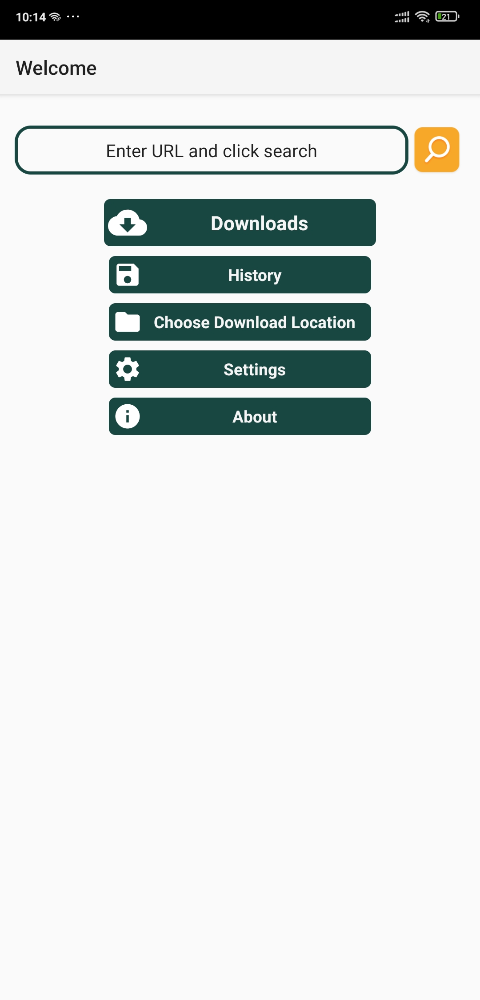
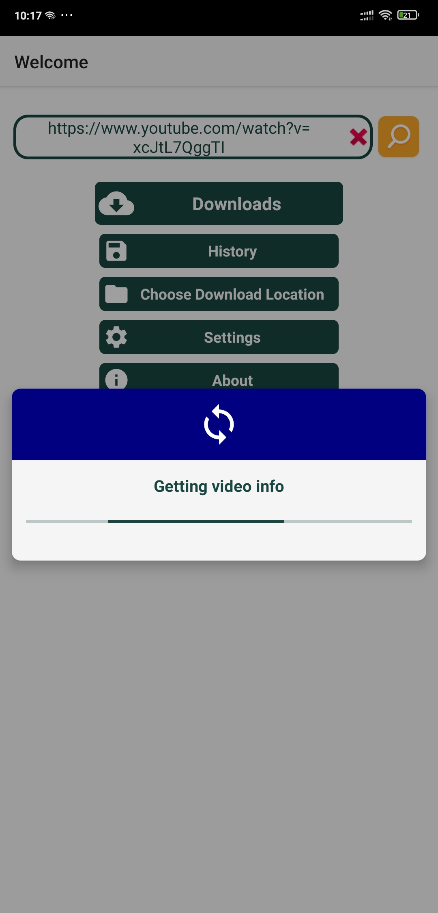
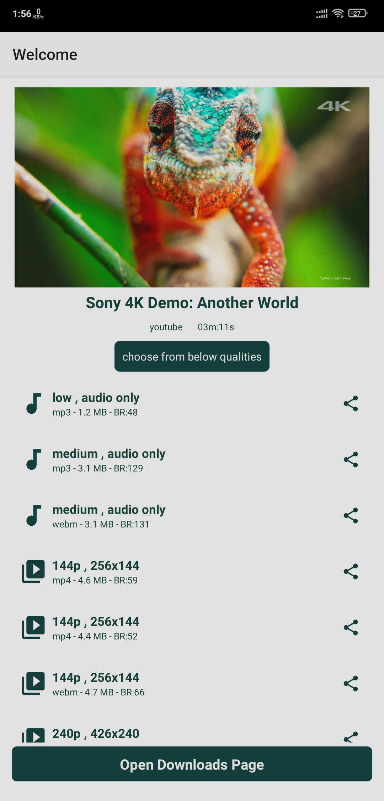
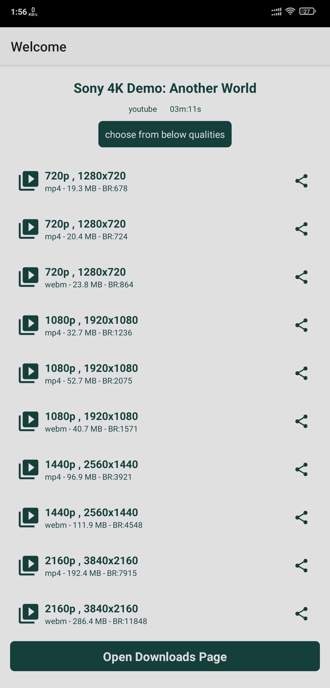
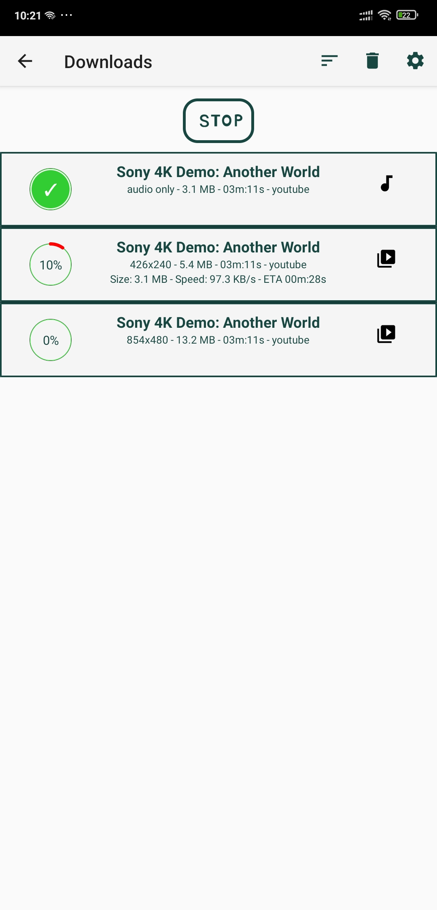
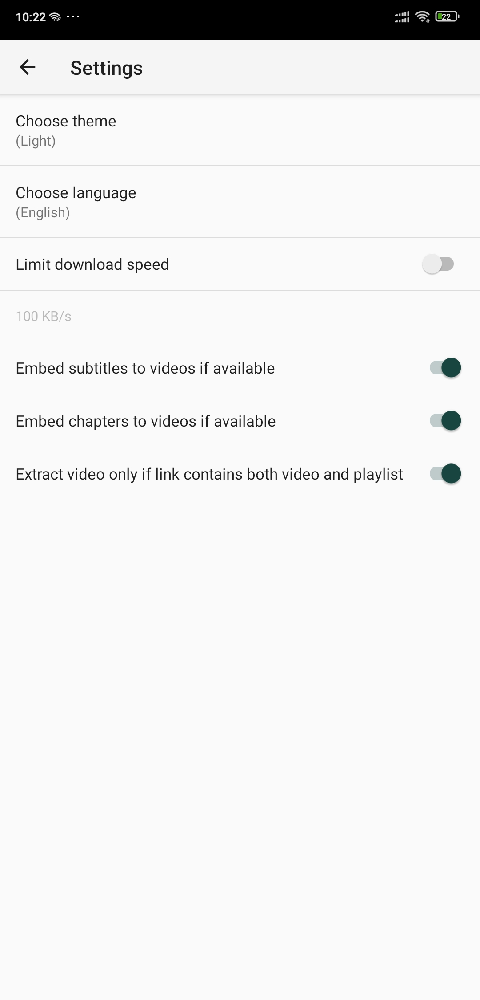
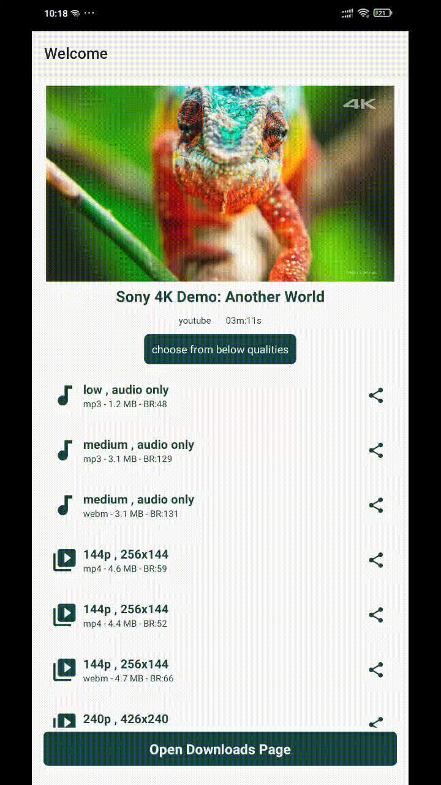

### VD-video-downloader

- Android app to download videos from youtube and 1000+ sites

- Based on ([yt-dlp](https://github.com/yt-dlp/yt-dlp))

- Features:
  - supports **playlist** download
  - **download location** chooser
  - display **progress bar** in downloads page and in notifications
  - save **history** of urls
  - handle **share** url intent
  - **update** yt-dlp library regularly

- Download latest APKs from the [releases page](https://github.com/hamedali1336/VD-video-downloader/releases)

- Screenshots

